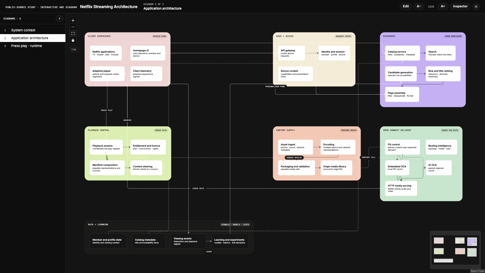

# arc-diagram-mcp

An MCP server that creates polished, interactive architecture-diagram applications instead of returning a diagram string.

## Example: Netflix streaming architecture

[](docs/images/netflix-application-architecture-ui.png)

The [complete Netflix example](examples/netflix-project.json) generates three connected views: system context, application architecture, and the numbered runtime journey from pressing play to Open Connect delivery. It is an illustrative reconstruction from public material—not a claim to reproduce Netflix's full internal design—grounded in the [Open Connect overview](https://openconnect.netflix.com/), [appliance and software architecture](https://openconnect.netflix.com/en/appliances/), and [AWS case study](https://aws.amazon.com/solutions/case-studies/innovators/netflix/).

```bash
npm run build
node dist/index.js create examples/netflix-project.json /absolute/path/to/netflix-architecture
```

Give an MCP-capable agent a system description, repository, or design document. The agent distils the source into the arc-diagram contract; this server validates it and scaffolds a complete React Flow application with:

- system-context, application, runtime, lifecycle, pyramid, and reference-model dialects;
- drag, resize, lasso, keyboard nudge, text sizing, and per-element styling;
- light and dark themes;
- chrome-free `?embed=<diagramId>` views;
- cropped 2× PNG exports and a self-contained offline HTML build;
- structural validation, canvas-text linting, geometric probes, UX probes, and visual baselines.

The shape is inspired by [phxdev1/archy-mcp](https://github.com/phxdev1/archy-mcp), but the output is different: Archy produces Mermaid; this project produces an editable multi-view React Flow application.

## MCP tools

| Tool | Purpose |
|---|---|
| `list_arc_diagram_dialects` | Explains when to use each visual grammar. |
| `get_arc_diagram_contract` | Returns the complete `DiagramDef` JSON schema and core authoring rules. |
| `validate_arc_diagram_set` | Checks IDs, references, steps, legends, and dialect constraints without writing. |
| `create_arc_diagram_project` | Writes a ready-to-run diagram project to an absolute local path. |

The MCP server deliberately has no second AI-provider dependency. The host model already understands the source; the server concentrates on a stable data contract, deterministic scaffolding, and verification.

## Install from source

```bash
git clone https://github.com/ArchiJones-AI/arc-diagram-mcp.git
cd arc-diagram-mcp
npm install
npm run build
```

Add the built server to any MCP client that accepts a stdio server:

```json
{
  "mcpServers": {
    "arc-diagram": {
      "command": "node",
      "args": ["/absolute/path/to/arc-diagram-mcp/dist/index.js"]
    }
  }
}
```

Restart the client after changing its MCP configuration.

## CLI

The same engine is usable without an MCP client:

```bash
npm run build
node dist/index.js validate examples/minimal-project.json
node dist/index.js create examples/minimal-project.json /absolute/path/to/output
```

The second command creates the application; it does not install its dependencies or run browsers. Continue inside the generated directory:

```bash
npm install
npm run dev
```

## Authoring flow

1. Inspect the source and choose each view's dialect from its structure or visual metaphor.
2. Call `get_arc_diagram_contract` and author `DiagramDef` objects with evidence in `citations`.
3. Call `validate_arc_diagram_set` until it returns `valid: true`.
4. Call `create_arc_diagram_project` with an absolute, empty destination.
5. Build and run the generated project's light/dark probes before taking its first visual baseline.

See [the authoring contract](docs/contract.md), the [minimal contract example](examples/minimal-project.json), and the [Netflix showcase](examples/netflix-project.json).

## Development

```bash
npm install
npm test
```

`npm test` compiles the server and exercises validation and deterministic project creation. The embedded template is independently typechecked during the repository smoke test.

## Safety

- Creation requires an absolute output path.
- A non-empty destination is refused unless `overwrite: true` is explicit.
- Overwrite mode replaces scaffold-managed files but preserves unrelated files.
- Repository analysis and claim grounding remain the responsibility of the calling agent; validation proves structural consistency, not architectural truth.

## License

Apache-2.0.
